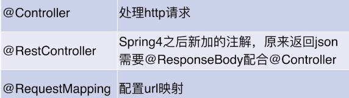
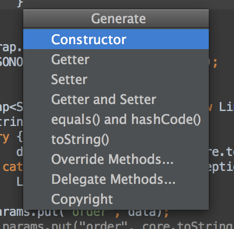

## spring boot 入门示例
- 参考：[慕课网：2小时学会Spring Boot](https://www.imooc.com/learn/767)
- 编辑器：IDEA （可以直接生成boot框架代码）
- demo主要内容：http请求方法(几种注解方法) + 数据库基本增删改查

- 进入目录后先把`mvn`相关的文件删掉

### 开发环境
- SpringBoot版本：2.0.
- jdk版本：1.8

### 开发工具
- IDEA2018
- PostMan
- Chrome


## 基础知识
### 两种启动方式
- 在IDEA中右键 run
- 在命令行项目根目录下：1.编译：mvn install 2.java -jar target/girl-0.0.1-SNAPSHOT.jar (加参数 --spring.profiles.active=prod)

### @value注解 - 从配置文件传值

### 从配置文件注入一个类
```
@Component
@ConfigurationProperties(prefix = "girl")
```
### Controller注解

处理url参数的一些注解


### getter setter生成快捷键
OSX: command+n
Windows: alt+insert


### IDEA 对 SpringBoot 项目热部署
```xml
<dependency>
    <groupId>org.springframework.boot</groupId>
    <artifactId>spring-boot-devtools</artifactId>
    <optional>true</optional>
</dependency>

```
```xml
<plugins>
    <plugin>
        <groupId>org.springframework.boot</groupId>
        <artifactId>spring-boot-maven-plugin</artifactId>
    </plugin>
    <plugin>
        <groupId>org.springframework.boot</groupId>
        <artifactId>spring-boot-maven-plugin</artifactId>
        <configuration>
            <!-- fork: 如果没有访项配置，devtools不会起作用，即应用不会重启 -->
            <fork>true</fork>
        </configuration>
    </plugin>
</plugins>
```
### 开发环境、生产环境分开配置(多环境配置)
```
spring:
  profiles:
    active: dev
```

## 数据库相关
### 数据库MySQL  Spring-Data-Jpa
JPA 定义了一系列对象持久化的标准（文本上的一个规范）
目前实现这一规范的产品有Hibernate\TopLink等

### Demo中的RESTful API设计：
- GET /girls 获取女生列表
- POST /girls 创建一个女生
- GET /girls/id 通过id查询一个女生
- PUT /girls/id 通过id更新一个女生
- DELETE /girls/id 通过id删除一个女生

### 1. 依赖
```xml
<dependency>
    <groupId>org.springframework.boot</groupId>
    <artifactId>spring-boot-starter-jpa</artifactId>
</dependency>

<dependency>
    <groupId>mysql</groupId>
    <artifactId>mysql-connector-java</artifactId>
</dependency>

```
### 2. 配置


## 踩坑 + 埋坑
- java 9及以上版本不支持`spring-boot-devtools`中的`ClassLoaders`方法，在`files -> project structure -> JDKs`中更换版本到`jdk8`即可

- 以下横线之间的这些坑，都是因为java版本选错了导致的（注意java版本选择本地的java10，boot版本选择1.5.x，2.0.x还没试），否则直接就可以右键运行不报错了

---------------------
### 在IDEA中修改了pom.xml不能生效
在文件名称或文件打开内容上`右键->maven->reimport`

### 设置pom.xml自动reimport


### 可视化查看依赖关系
`窗口右侧->maven Project->右键 show dependencies`（这里可以查看依赖冲突）
或`View -> Tool Windows -> maven projects` 找到工具窗口

### logback 和 log4j 依赖冲突
去掉一个依赖
```$xslt
<dependency>
    <groupId>org.springframework.boot</groupId>
    <artifactId>spring-boot-starter-web</artifactId>
    <exclusions>
        <exclusion>
            <groupId>org.springframework.boot</groupId>
            <artifactId>spring-boot-starter-logging</artifactId>
        </exclusion>
    </exclusions>
</dependency>

```
### log4j初始化错误
在resources目录下添加`log4j.properties`文件，内容如下
```
log4j.rootLogger=INFO, Console
log4j.appender.Console=org.apache.log4j.ConsoleAppender
log4j.appender.Console.layout=org.apache.log4j.PatternLayout
log4j.appender.Console.layout.ConversionPattern=(%r ms) [%t] %-5p: %c#%M %x: %m%n
```
-----------------------------