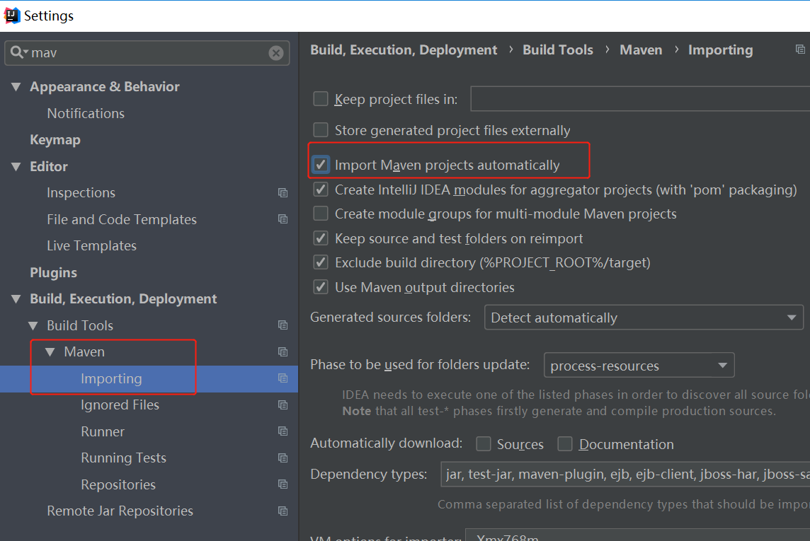

# spring boot 入门学习
- 参考：[慕课网：2小时学会Spring Boot](https://www.imooc.com/learn/767) | [慕课网：Spring Boot进阶之Web进阶](https://www.imooc.com/learn/810)
- 编辑器：IDEA （可以直接生成boot框架代码）
- demo主要内容：http请求方法(几种注解方法) + 数据库基本增删改查

### 开发环境
- SpringBoot版本：2.0.
- jdk版本：1.8

### 开发工具
- IDEA2018
- PostMan
- Chrome

### 内容
- 基础 
    - hello world
    - 属性配置
    - Controller使用
    - 数据库操作
    - 事务管理
- 进阶
    - 表单验证 @Valid
    - AOP处理请求 
    - 统一异常处理（自定义异常类捕获异常）
    - 单元测试 

## 1. 基础知识
### 两种启动方式
- 在IDEA中右键 run
- 在命令行项目根目录下：1.编译：mvn install 2.java -jar target/girl-0.0.1-SNAPSHOT.jar (加参数 --spring.profiles.active=prod)

### @value注解 - 从配置文件传值

### 从配置文件注入一个类
```
@Component
@ConfigurationProperties(prefix = "girl")
```
### Controller注解

处理url参数的一些注解


### getter setter生成快捷键
OSX: command+n
Windows: alt+insert


### IDEA 对 SpringBoot 项目热部署
```xml
<dependency>
    <groupId>org.springframework.boot</groupId>
    <artifactId>spring-boot-devtools</artifactId>
    <optional>true</optional>
</dependency>

```
```xml
<plugins>
    <plugin>
        <groupId>org.springframework.boot</groupId>
        <artifactId>spring-boot-maven-plugin</artifactId>
    </plugin>
    <plugin>
        <groupId>org.springframework.boot</groupId>
        <artifactId>spring-boot-maven-plugin</artifactId>
        <configuration>
            <!-- fork: 如果没有访项配置，devtools不会起作用，即应用不会重启 -->
            <fork>true</fork>
        </configuration>
    </plugin>
</plugins>
```
### 开发环境、生产环境分开配置(多环境配置)
```
spring:
  profiles:
    active: dev
```
### post\put 方法传参，在postMan中的设置


### 多点选择
alt + shift + mouse

### 给maven配置阿里云镜像，在`C:/user/[user name]/.m2`路径下添加或修改`settings.xml`文件
```xml
 <settings xmlns="http://maven.apache.org/SETTINGS/1.0.0"
        xmlns:xsi="http://www.w3.org/2001/XMLSchema-instance"
        xsi:schemaLocation="http://maven.apache.org/SETTINGS/1.0.0
                            https://maven.apache.org/xsd/settings-1.0.0.xsd">
        <localRepository/>
        <interactiveMode/>
        <usePluginRegistry/>
        <offline/>
        <pluginGroups/>
       <servers/>
    <mirrors>
     <mirror>
       <id>alimaven</id>
       <name>aliyun maven</name>
       <url>http://maven.aliyun.com/nexus/content/groups/public/</url>
       <mirrorOf>central</mirrorOf>
     </mirror>
   </mirrors>
       <proxies/>
       <profiles/>
       <activeProfiles/>
 </settings>
```


## 2. 数据库相关
### 数据库MySQL  Spring-Data-Jpa
JPA 定义了一系列对象持久化的标准（文本上的一个规范）
目前实现这一规范的产品有Hibernate\TopLink等

### Demo中的RESTful API设计：
- GET /girls 获取女生列表
- POST /girls 创建一个女生
- GET /girls/id 通过id查询一个女生
- PUT /girls/id 通过id更新一个女生
- DELETE /girls/id 通过id删除一个女生

### 依赖
```xml
<dependency>
    <groupId>org.springframework.boot</groupId>
    <artifactId>spring-boot-starter-data-jpa</artifactId>
</dependency>

<dependency>
    <groupId>mysql</groupId>
    <artifactId>mysql-connector-java</artifactId>
</dependency>

```
### 配置
```
spring:
  profiles:
    active: dev
  datasource:
    driver-class-name: com.mysql.jdbc.Driver
    url: jdbc:mysql://127.0.0.1:3306/dbgirl
    username: root
    password: 123456
  jpa:
    hibernate:
      ddl-auto: create # 在运行时自动创建一个表
    show-sql: true # 在控制台里面看到sql语句
```

### 如果事务操作@Transaction不生效可能是数据表类型不对所致
只有innodb类型的数据库才支持事务

alter table table_name engine=innodb;  

### mysql升级后报警告
Java连接Mysql数据库警告：
> Establishing SSL connection without server's identity verification is not recommend

Java使用mysql-jdbc连接MySQL出现如下警告：

> Establishing SSL connection without server's identity verification is not recommended. According to MySQL 5.5.45+, 5.6.26+ and 5.7.6+ requirements SSL connection must be established by default if explicit option isn't set. For compliance with existing applications not using SSL the verifyServerCertificate property is set to 'false'. You need either to explicitly disable SSL by setting useSSL=false, or set useSSL=true and provide truststore for server certificate verification.

原因是MySQL在高版本需要指明是否进行SSL连接。解决方案如下：

在mysql连接字符串url中加入ssl=true或者false即可，如下所示。
`url=jdbc:mysql://127.0.0.1:3306/framework?characterEncoding=utf8&useSSL=true`

## 3. 踩坑 + 埋坑
- java 9及以上版本不支持`spring-boot-devtools`中的`ClassLoaders`方法，在`files -> project structure -> JDKs`中更换版本到`jdk8`即可

### !!!!! 之前的各种依赖冲突报错可能都是由于这个问题 
java.lang.NoSuchMethodError: javax.persistence.spi.PersistenceUnitInfo.getValidationMode()Lja
>这个问题困扰了我一天原来是servlet跟javaee.jar里面的jpa接口冲突了。解决方法是：
移除MyEclipse自带的javaEE包加入javaEE中的jsf-api.jar jsf-impl.jar jstl-1.2.jar 包，
再加入tomcat中的servlet-api.jar，其实就是将javaEE中的javaee.jar用tomcat中的servlet-api.jar换掉，
这样这个问题就解决了。

### Cannot resolve Entity
- Go to `File > Project Structure > Facets`. 
- Then click on the + icon and add JPA to your project/module. After you've done this, you can select a Default JPA Provider. 
- 然后点击fix问题 download ok

### spring boot 写一个web项目，在使用spring-data-jpa的时候，启动报如下错误：
    
> Error starting ApplicationContext. To display the auto-configuration report re-run your application with 'debug' enabled.
    2018-04-02 17:00:47.076 ERROR 4648 --- [main] o.s.boot.SpringApplication : Application startup failed
    
- 解决方式：加入依赖既可

```xml
<dependency>
    <groupId>org.hibernate</groupId>
    <artifactId>hibernate-entitymanager</artifactId>
    <version>5.0.3.Final</version>
</dependency>
```    
另外，有看到资料说，在mainApplication中，加如下注解也可以解决：

`@EnableAutoConfiguration(exclude={DataSourceAutoConfiguration.class})`

启动的确不报错了，但是此时，自动创建表功能并未实现，建议用第一种方式。

### 添加classPath
- file - project structure - SDKs
### tomcat server配置
- file - settings - build, execution, development - application server


- 以下横线之间的这些坑，都是因为java版本选错了导致的（注意java版本选择本地的java10，boot版本选择1.5.x，2.0.x还没试），否则直接就可以右键运行不报错了

---------------------
### 在IDEA中修改了pom.xml不能生效
在文件名称或文件打开内容上`右键->maven->reimport`

### 设置pom.xml自动reimport


### 可视化查看依赖关系
`窗口右侧->maven Project->右键 show dependencies`（这里可以查看依赖冲突）
或`View -> Tool Windows -> maven projects` 找到工具窗口

### logback 和 log4j 依赖冲突
去掉一个依赖
```$xslt
<dependency>
    <groupId>org.springframework.boot</groupId>
    <artifactId>spring-boot-starter-web</artifactId>
    <exclusions>
        <exclusion>
            <groupId>org.springframework.boot</groupId>
            <artifactId>spring-boot-starter-logging</artifactId>
        </exclusion>
    </exclusions>
</dependency>

```
### log4j初始化错误
在resources目录下添加`log4j.properties`文件，内容如下
```
log4j.rootLogger=INFO, Console
log4j.appender.Console=org.apache.log4j.ConsoleAppender
log4j.appender.Console.layout=org.apache.log4j.PatternLayout
log4j.appender.Console.layout.ConversionPattern=(%r ms) [%t] %-5p: %c#%M %x: %m%n
```
-----------------------------


## 4. AOP
### AOP是一种程序设计思想（编程范式）
- 面向切面编程
- 相对应的：
    - OOP 面向对象
    - POP 面向过程
- 将通用逻辑从业务逻辑中分离出来
- 举例：接收请求时判断是否登录

- tip：一般来说添加一个依赖的步骤
    - pom中添加依赖
    - 在启动类添加一个注解（aop不用加）
    - 建立数据文件
    
### 依赖
```xml
<dependency>
    <groupId>org.springframework.boot</groupId>
    <artifactId>spring-boot-starter-aop</artifactId>
</dependency>
```

### 日志打印
private final static org.slf4j.Logger logger = LoggerFactory.getLogger(HttpAspect.class);
logger.info("lkjsdf");

## 异常处理

## 单元测试
- 项目打包的时候会自动跑单元测试并输出结果，如果有测试错误，则打包失败
`mvn clean package`
- 打包过程跳过单元测试:
`mvn clean package -Dmaven.test.skip=true`

## TODO - List
- 泛型 T